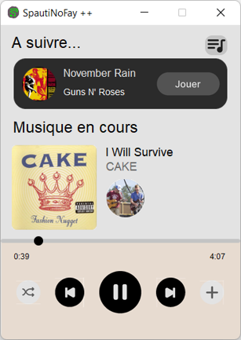

# SpautiNoFay

**A simple and beautiful music player created with Python**

### Why SpautiNoFay ?

SpautiNoFay is a project created by a friend and I to initiate us to Python. We noticed that there's no simple and modern music players available on GitHub, I's why, we share our app and we hope it will be usefull.

### How it works ?

The music player's UI has been designed with Figma and ported to Tkinter with the [tkinter-designer](https://github.com/ParthJadhav/Tkinter-Designer/) package. The music is played with the PyGame mixer. It use some others packages to improve the user experience.

SpautiNoFay takes YouTube music links, download the audio and convert them to mp3 (needs FFmpeg). The audio files are saved for another time in a musics folder.

### Infos

If you want to improve the project, you are free to do it, I will be happy to accept your PRs.

The project has been initialy coded with all the variable's names in French so I may forgot to change some.
